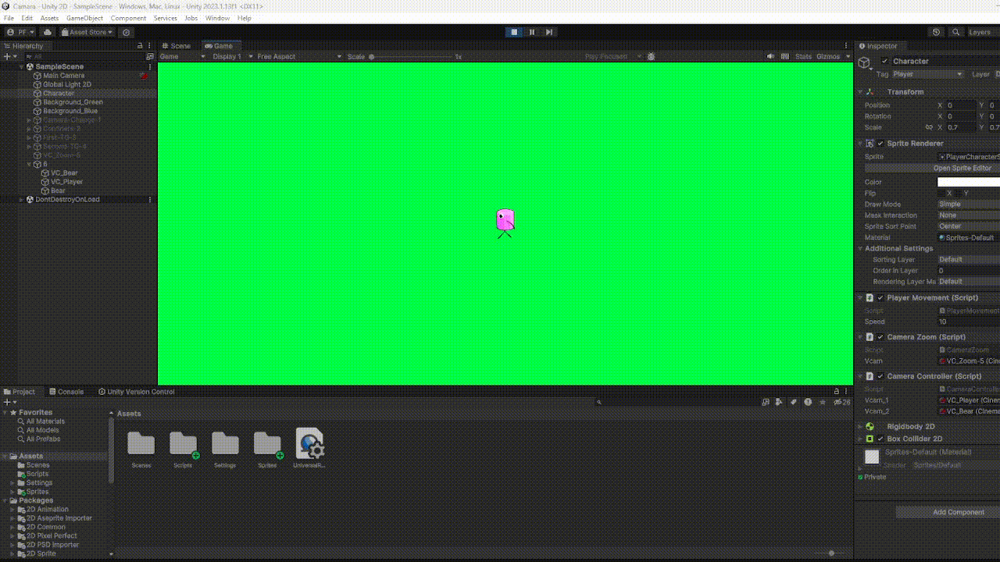

# Cámara Unity - FDV

Las cámaras en los videojuegos son fundamentales para garantizar una experiencia visual coherente y clara para el jugador, ya que definen qué parte del mundo del juego es visible en pantalla. Cada tipo de juego requiere un comportamiento específico de las cámaras: en un puzzle, la cámara es estática y muestra todo el tablero; en un shooter en primera persona, la cámara se coloca a la altura de los ojos del personaje; y en un juego de carreras, la cámara sigue al vehículo.

En juegos 2D, se suelen emplear efectos de cámara como:

- **Seguimiento de personajes** para mantener al protagonista siempre visible.
- **Definición del área visible** para ajustar qué parte del mundo se muestra en pantalla.
- **Zoom y enfoque dinámico** para acercar o alejar la cámara, resaltando áreas clave.
- **Transiciones de escena** para cambios suaves entre niveles.
- **Efectos visuales** como sacudidas o desenfoques.
- **Pantalla dividida** en juegos multijugador, permitiendo varias perspectivas.

Unity ofrece el paquete **Cinemachine**, una herramienta que facilita el control de cámaras mediante cámaras virtuales o controladores, que permiten efectos avanzados como seguimiento de objetos, encuadre automático, seguimiento de grupos y combinaciones de cámaras.

## Tarea 1 - Instalar el paquete CineMachine y configurar 2 cámaras virtuales con diferentes zonas de seguimiento al jugador. Mostar el efecto mediante un gif animado.

En esta tarea, creé dos cámaras virtuales: **VC_1**, con un tamaño ortográfico mayor, y **VC_2**, con un tamaño ortográfico menor. Por defecto, la **VC_1** está activa para una vista amplia del entorno. Para cambiar a la **VC_2**, implementé un script que, al detectar una colisión del jugador con un objeto específico, aumenta la prioridad de esta última, activando una vista más cercana al jugador.

```csharp
public class CameraChange : MonoBehaviour
{
    public CinemachineVirtualCamera camaraSecundaria;

    private void OnTriggerEnter2D(Collider2D other)
    {
        if (other.CompareTag("Player"))
        {
            
            camaraSecundaria.Priority = 11;
        }
    }
}
```


*Figura 1: Cambio de camara con un colisión*

## Tarea 2 - Define un área de confinamiento diferente para cada una de las dos cámaras de la tarea anterior. Realiza una prueba de ejecución con el correspondiente gif animado que permita ver las diferencias.


En esta actividad, he definido un área de confinamiento específica para cada cámara virtual: **VC_1** y **VC_2**. La cámara **VC_1** está limitada a visualizar únicamente la zona verde, mientras que VCM_2 tiene un alcance mayor, permitiendo ver tanto la zona verde como la zona azul.


*Figura 2: Fondos de distinto color*


*Figura 3: Cambio de Confiner cuando hay colisión*

## Tarea 3 - Agrega varios sprites en la escena que estén realizando un movimiento (mínimo 3). Genera una cámara adicional que le haga el seguimiento a dichos objetos.

Primero, creé un **Target Group** en el que incluí a tres enemigos. Este **Target Group** se asigna a una nueva cámara virtual llamada **VC_TG**, permitiendo que la cámara siga el movimiento de estos tres objetivos. En este ejemplo, **VC_TG** tiene una prioridad de 20 para asegurar que no haya conflictos con otras cámaras en la escena.


*Figura 4: Camara siguiendo el movimiento del Target Group*

## Tarea 4 - Agrega 2 sprites adicionales en la escena que estén realizando un movimiento Genera una cámara adicional que le haga el seguimiento a dichos objetos, cada uno con un peso en la importancia del seguimiento diferente.

En esta actividad, añadí dos sprites distintos y asigné un mayor peso al sprite ubicado a la izquierda, de modo que la cámara priorice mostrarlo antes que al sprite de la derecha. En la figura 5 se muestran los pesos asignados a cada sprite.


*Figura 5: Pesos de cada enemigo*


*Figura 6: Camara siguiendo el movimiento del Target Group con pesos*

## Tarea 5 - Implementar un zoom a la cámara del jugador que se controle con las teclas w-s.

Para esta actividad, he creado un script que permite controlar el zoom de la cámara. Al presionar la tecla **W**, la cámara realiza un acercamiento (zoom in), y al presionar la tecla **S**, se aleja (zoom out). El tamaño ortográfico predeterminado de la cámara es de 10.

```csharp
public class CameraZoom : MonoBehaviour
{
    public CinemachineVirtualCamera vcam;

    void Update()
    {
        Zoom();
    }
    
    private void Zoom()
    {
        if (Input.GetKey(KeyCode.W))
        {
            vcam.m_Lens.OrthographicSize = 2.5f;
        }

        if (Input.GetKey(KeyCode.S))
        {
            vcam.m_Lens.OrthographicSize = 10;
        }
    }
}
```


*Figura 7: Activando y desactivando el Zoom*

## Tarea 6 - Seleccionar un conjunto de teclas que permitan hacer el cambio entre dos cámaras. (Habilitar/Deshabilitar el gameobject de la cámara virtual)

En esta actividad, he desarrollado un script que permite alternar entre dos cámaras: una que sigue al jugador y otra que enfoca a un oso en una posición fija. Al presionar la tecla **Q**, se activa la cámara que sigue al jugador, mientras que al presionar la tecla **E**, se cambia a la cámara enfocada en el oso.

```csharp
public class CameraController : MonoBehaviour
{
    public CinemachineVirtualCamera vcam_1;
    public CinemachineVirtualCamera vcam_2;

    void Update()
    {
        Zoom();
    }

    private void Zoom()
    {
        if (Input.GetKey(KeyCode.Q))
        {
            vcam_1.Priority = 20;
            vcam_2.Priority = 10;
        }

        if (Input.GetKey(KeyCode.E))
        {
            vcam_2.Priority = 20;
            vcam_1.Priority = 10;
        }
    }
}
```



*Figura 8: Cambio de camara con teclas*

## Tarea 7 - Crear un script para activar la cámara lenta cuando el personaje entre en colisión con un elemento de la escena que elijas para activar esta propiedad.

En esta actividad, desarrollé un script que reduce la velocidad del jugador cuando entra en un **Box Collider2D**. La cámara lenta permanece activa mientras el jugador esté dentro del área del **Box Collider2D** y solo se desactiva cuando el jugador sale de esta zona. Cabe mencionar que este **Box Collider2D** se encuentra en la parte izquierda de la pantalla.

```csharp
public class SlowMotionMovement : MonoBehaviour
{
    public CinemachineVirtualCamera slowMotionCamera;
    public float slowMotionTimeScale = 0.5f;

    private float originalTimeScale;

    void Start()
    {
        originalTimeScale = Time.timeScale;
    }

    private void OnTriggerEnter2D(Collider2D other)
    {
        if (other.CompareTag("Player"))
        {
            ActivateSlowMotion();
        }
    }

    private void OnTriggerExit2D(Collider2D other)
    {
        if (other.CompareTag("Player"))
        {
            RestoreNormalTime();
        }
    }

    void ActivateSlowMotion()
    {
        Time.timeScale = slowMotionTimeScale;
        Time.fixedDeltaTime = 0.02f * Time.timeScale;
        slowMotionCamera.Priority = 15;
    }

    void RestoreNormalTime()
    {
        Time.timeScale = originalTimeScale;
        Time.fixedDeltaTime = 0.02f * Time.timeScale;
        slowMotionCamera.Priority = 5;
    }
}
```


*Figura 9: Reducción de velocidad del juego*

## Tarea 8 - Crear un script para activar la cámara rápida cuando el personaje entre en colisión con un elemento de la escena que elijas para activar esta propiedad.

En esta actividad, desarrollé un segundo script similar al anterior, pero diseñado específicamente para modificar el valor de `fastMotionTimeScale`, este variable hace referencia a la variable `slowMotionTimeScale` del script anterior. Esto permite distinguir claramente ambos scripts: uno ralentiza el tiempo, mientras que el otro lo acelera. El **Box Collider2D** correspondiente a este script está ubicado en el lado izquierdo de la pantalla y activa el aumento en `fastMotionTimeScale` cuando el jugador entra en su área.


*Figura 10: Aumento de velocidad del juego*

## Tarea 9 - Crear un script para intercambiar la cámara activa, una estará confinada y la otra no, cuando el personaje entre en colisión con un elemento de la escena que elijas para activar esta propiedad.


En esta última actividad, desarrollé un script que permite alternar entre una cámara que está confinada dentro de ciertos límites y otra que no tiene restricciones. Para esta implementación, utilicé el confiner que creé en la actividad 2. Cuando el jugador colisiona con el Box Collider2D, se activa el cambio a la cámara sin límites, desactivando así el efecto del confiner.

```csharp
public class CameraSwitcher : MonoBehaviour
{
    public CinemachineVirtualCamera confinedCamera;
    public CinemachineVirtualCamera unconfinedCamera;
    private CinemachineVirtualCamera activeCamera;
    private bool isConfinedActive = true;

    IEnumerator Start()
    {
        yield return null;

        activeCamera = confinedCamera;
        activeCamera.Priority = 10;
        unconfinedCamera.Priority = 5;
    }

    private void OnTriggerEnter2D(Collider2D other)
    {
        if (other.CompareTag("Player"))
        {
            SwitchCamera();
        }
    }

    void SwitchCamera()
    {
        if (isConfinedActive)
        {
            confinedCamera.Priority = 5;
            unconfinedCamera.Priority = 10;
            activeCamera = unconfinedCamera;
        }
        else
        {
            confinedCamera.Priority = 10;
            unconfinedCamera.Priority = 5;
            activeCamera = confinedCamera;
        }

        isConfinedActive = !isConfinedActive;
    }
}
```


*Figura 11: Cambio de camara a camara sin confinar*

> Para las 3 últimas actividades se han tenido que tocar las prioridades de las camaras para que el funcionamiento sea el esperado